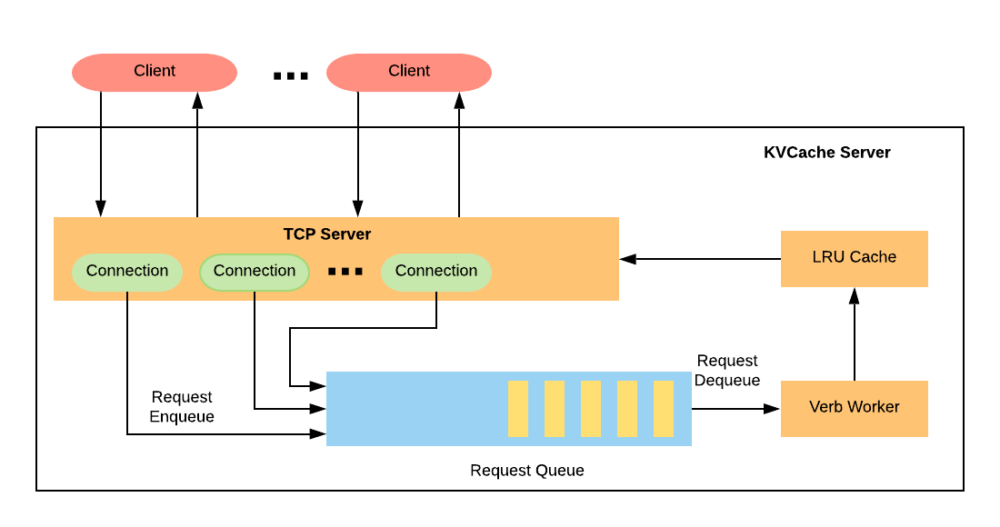

# KVCache

This provides a high-performance concurrent Kev-Value cache server. Clients of KVCache communicate with server through TCP connections. A given running KVCache server listens on some
(configurable) port; clients connect to that port, send commands to the server, read responses, and eventually close the connection.


## Build The project

```
make
```

## Run all the unit tests

```
make test
```

## Run the server

```
make run
```

## Operation Support
Get value for a key. If the key is not set, returns "Not Found", otherwise returns the value.
```
get someKey
```

Set value for a key. Set the value for a key. It returns "Success" if the operation is succeed.
```
set someKey
someValue
```

##  Play with telnet

```
$ telnet localhost 11211
Trying ::1...
Connected to localhost.
Escape character is '^]'.
get somekey
Not Found
End
set somekey
someValue
Success
get somekey
someValue
End
```

## High Level Design

